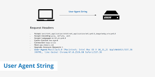

|Methods|Explanation|
|---|---|
|Using Spoofing User Agents|`User Agent` are different from `User-Agent` request header.  According to [MDN Web Docs](https://developer.mozilla.org/en-US/docs/Web/HTTP/Headers/User-Agent), `User-Agent` request header is a characteristic string that lets servers and network peers identify the application, opeartiong system, vendor, and/or version of the requesting `user agent`.  For example, in terms of `Chrome UA string` (also `Chromium`/`Blink-based engines user agent`), adds strings like `HKTML, like Gecko` and `Safari` for compatibility.  <pre>Mozilla/5.0 (X11; Linux x86_64) AppleWebKit/537.36 (KHTML, like Gecko) Chrome/51.0.2704.103 Safari/537.36</pre>  However, for `User Agent`, it is any software that retrieves, renders and facilitates end user interaction with Web content, or whose user interface is implemented using Web technologies.  |
|Using Proxies|According to [JavaPoint], a `proxy server` is an agent that accepts incoming requests from the client and forwards those requests to the destination server, which servers as a gateway between the end-user and the Internet, with its own `IP address`.  The most important point about a `proxy server` is that it does not encrypt traffic.  There are many types of proxy servers, including `Forward/Open Proxy Server`, `Reverse Proxy Server`, `Split Proxy Server`, `Transparent Proxy`, `Non-transparent Proxy`, `Hostile Proxy`, `Intercepting PRoxy Server`, `Forced Proxy Server`, `Caching Proxy Server`, `Web Proxy Server`, `Anonymous Proxy`, `Socks Proxy`, `High Anonymity Proxy`, `Rotating Proxy`, `SSL Proxy Server`, `Shared Proxy`, `Public Proxy`, `Residential Proxy`, `Distorting Proxy`, `Data Center Proxy`, and `HTTP Proxy`.  It is in fact quite similar to a `VPN`, the only difference is that `VPN` encrypts traffic.|
|Disable-blink-features||
|Exclude the collection of enable-automation switches||
|Turn-off useAutomationExtension||
